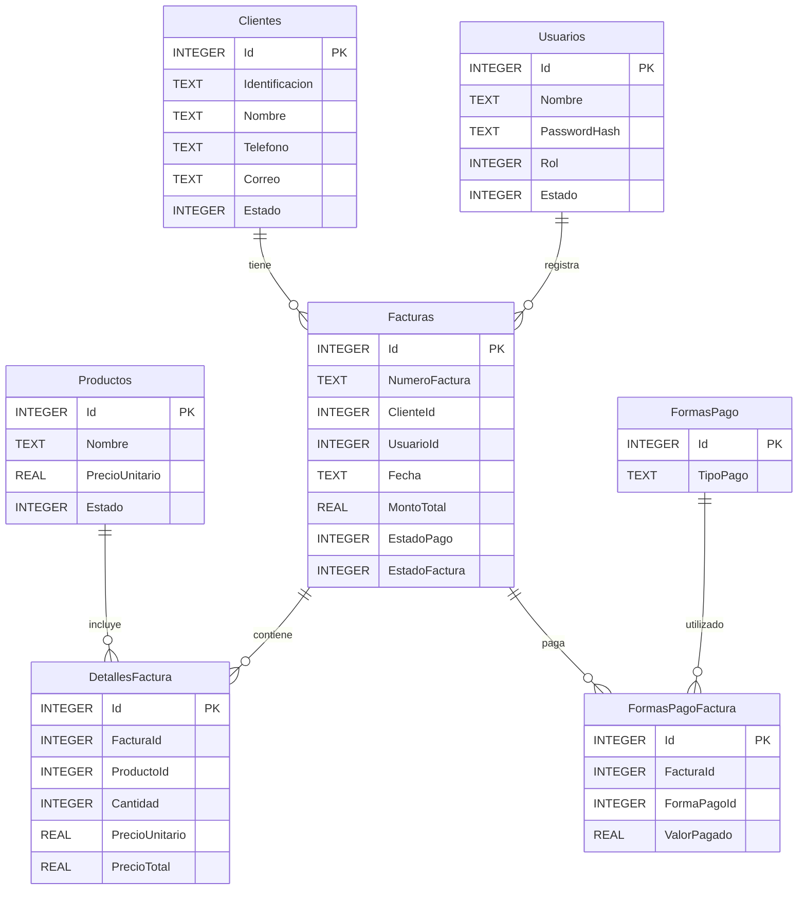

# Sistema de Ingreso y Gestión de Facturas

## 📌 Descripción
Este proyecto implementa una solución web para el **ingreso, gestión y consulta de facturas**, incluyendo la administración de clientes, productos y usuarios (vendedores).

La solución fue desarrollada como **prueba técnica**, priorizando:
- Diseño limpio
- Buenas prácticas
- Seguridad
- Claridad arquitectónica
- Facilidad de ejecución local

---

## 🏗️ Arquitectura General

La solución está dividida en **dos proyectos independientes**:

- /backend → API REST (.NET)
- /frontend → Web SPA (Angular)

Esta separación permite:
- Desacoplar frontend y backend
- Facilitar escalabilidad
- Mantener responsabilidades claras

---
```plaintext
FacturaPrj/
│
├── Backend/                # Proyecto C#.NET API
│   ├── Controllers/        # Controladores REST (Facturas, Clientes, Productos, Usuarios)
│   ├── Database/           # Scripts SQL y archivo SQLite
│   ├── Models/             # Clases de entidades (Usuario, Factura, Cliente, etc)
│   ├── Persistence/        # Acceso y persistencia de datos
│   │   ├── Context/        # Configuracion de conexion con SQLite
│   │   ├── Logging/        # Registro de logs del sistema
│   │   └── Repositories/   # Interfaces y Acceso a datos (ADO.NET con SQLite)
│   ├── Services/           # Lógica de negocio
│   ├── └── Interfaces/     # Interfaces para la capa de negocio
│   └── Program.cs          # Configuración principal del API
│
├── Frontend/               # Proyecto Angular
│   ├── src/
│   │   ├── app/
│   │   │   ├── components/     # Componentes del sitio
│   │   │   │   ├── clientes/   # Módulo CRUD clientes
│   │   │   │   ├── facturas/   # Módulo CRUD facturas + filtros
│   │   │   │   ├── login/   	# Módulo de Login
│   │   │   │   ├── productos/  # Módulo CRUD productos
│   │   │   │   ├── usuarios/   # Módulo CRUD vendedores
│   │   │   │   └── shared/     # Componentes y servicios comunes
│   │   │   ├── guards/     	# Control de acceso según rol
│   │   │   ├── interceptors/   # Añadir el token JWT en cada petición
│   │   │   ├── models/   	# Clases de entidades
│   │   │   ├── services/	# Llamadas HTTP al backend y lógica de negocio del frontend
│   │   └── environments/       # Variables según entorno
│   └── angular.json
│
├── Docs/                   # Documentación
│   └── MER.pdf             # Modelo entidad-relación
│
├── README.md               # Guía rápida del proyecto
│
└── .git/                   # Repositorio Git
```

## 🔧 Backend

### 📚 Stack Tecnológico
- **.NET 6+** – API REST
- **SQLite** – Base de datos relacional ligera
- **ADO.NET** – Acceso a datos
- **JWT (JSON Web Token)** – Autenticación
- **BCrypt** – Encriptación de contraseñas

> ⚠️ **Nota importante**:  
> No se utiliza Entity Framework porque me gusta el control directo del acceso a datos y consultas SQL parametrizadas.

---

### 🧱 Estructura del Backend
```plaintext
├── Backend/                # Proyecto C#.NET API
│   ├── Controllers/        # Controladores REST (Facturas, Clientes, Productos, Usuarios)
│   ├── Database/           # Scripts SQL y archivo SQLite
│   ├── Models/             # Clases de entidades (Usuario, Factura, Cliente, etc)
│   ├── Persistence/        # Acceso y persistencia de datos
│   │   ├── Context/        # Configuracion de conexion con SQLite
│   │   ├── Logging/        # Registro de logs del sistema
│   │   └── Repositories/   # Interfaces y Acceso a datos (ADO.NET con SQLite)
│   ├── Services/           # Lógica de negocio
│   ├── └── Interfaces/     # Interfaces para la capa de negocio
│   └── Program.cs          # Configuración principal del API
```

Este diseño busca:
- Separación de responsabilidades
- Código mantenible
- Facilidad de pruebas
- Claridad para equipos técnicos

---

### 🔐 Seguridad

La API implementa mecanismos básicos de seguridad:

- Autenticación mediante **JWT**
- Encriptación de contraseñas con **BCrypt**
- Uso exclusivo de **consultas SQL parametrizadas** para evitar SQL Injection
- Separación entre entidades y DTOs para no exponer el modelo interno

---

### 🗄️ Modelo de Datos (Resumen)

Entidades principales:

- **Clientes**
- **Usuarios (Vendedores)**
- **Productos**
- **Facturas**
- **DetalleFactura**
- **FormasPago**

Relaciones:
- Cliente 1—N Facturas
- Usuario 1—N Facturas
- Factura 1—N DetalleFactura
- Producto 1—N DetalleFactura
- Factura 1—N FormasPagoFactura
- FormasPago 1—N FormasPagoFactura

--> Las fechas se manejan en formato **ISO-8601** (`yyyy-MM-dd`) para interoperabilidad.

## 📊 Mini MER (Modelo Entidad-Relación)




---

## 🌐 Frontend

### 📚 Stack Tecnológico
- **Angular 17+**
- **Angular Material**

### 🎯 Enfoque
El frontend es una **Single Page Application (SPA)** con un diseño:
- Simple
- Claro
- No sobrecargado
- Funcional (no “fancy”, pero tampoco monocromático)

Funcionalidades principales:
- CRUD de clientes
- CRUD de productos
- CRUD básico de usuarios
- Creación y consulta de facturas
- Filtros por número, fecha y monto

---

## ⚙️ Funcionalidades Implementadas

- Autenticación de usuarios
- Creación de facturas con:
  - Cliente
  - Vendedor
  - Fecha
  - Detalle de productos
  - Múltiples formas de pago
- Consulta y visualización de facturas
- Impresión de facturas
- Búsqueda y filtrado
- Persistencia en SQLite

---

## 🧠 Decisiones Técnicas Relevantes

- **SQLite**: elegido para simplificar la ejecución local sin sacrificar integridad relacional.
- **ADO.NET**: uso explícito de SQL para mayor control y seguridad.
- **JWT**: autenticación stateless ideal para SPA.
- **No edición de facturas**: por buenas prácticas contables; una vez emitida, una factura no debería modificarse directamente.

---

## 🚀 Cómo ejecutar el proyecto

### Backend
```bash
dotnet restore
dotnet run
```
La API quedará disponible en:
```bash
https://localhost:5001
```
Dependencias en caso de que no las pueda resintalar:
  JwtBearer
```bash
dotnet add package Microsoft.AspNetCore.Authentication.JwtBearer --version 8.0.0
```
  BCrypt.Net
```bash
dotnet add package BCrypt.Net-Next
```

Frontend
```bash
npm install
ng serve
```
## 🔮 Mejoras Futuras

- Tests unitarios robustos
- Manejo de roles y permisos
- Paginación avanzada
- Auditoría de operaciones
- Despliegue automatizado
- Observabilidad (logs y métricas)

## 🧾 Notas Finales

Este proyecto prioriza:
- Claridad sobre complejidad
- Seguridad sobre velocidad
- Diseño sostenible sobre soluciones rápidas

Está pensado para ser extendido fácilmente por un equipo de desarrollo o por quin le ponga ganas 💪😵🚀😂.

> Si algo falla, no es un bug… es una feature en potencia 🚀.**
